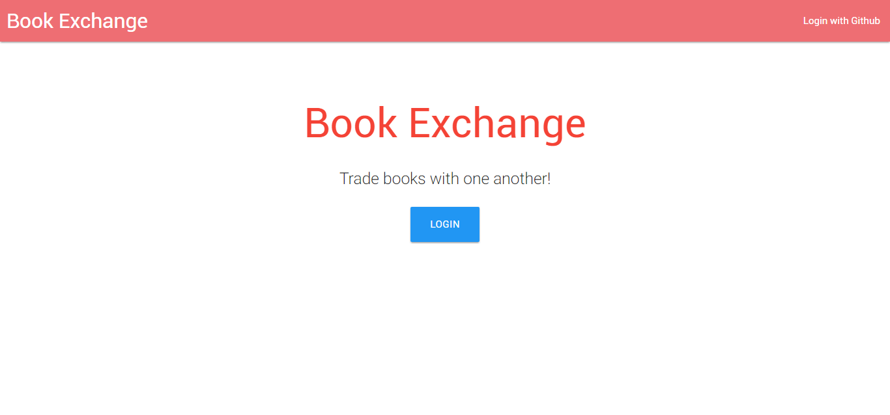
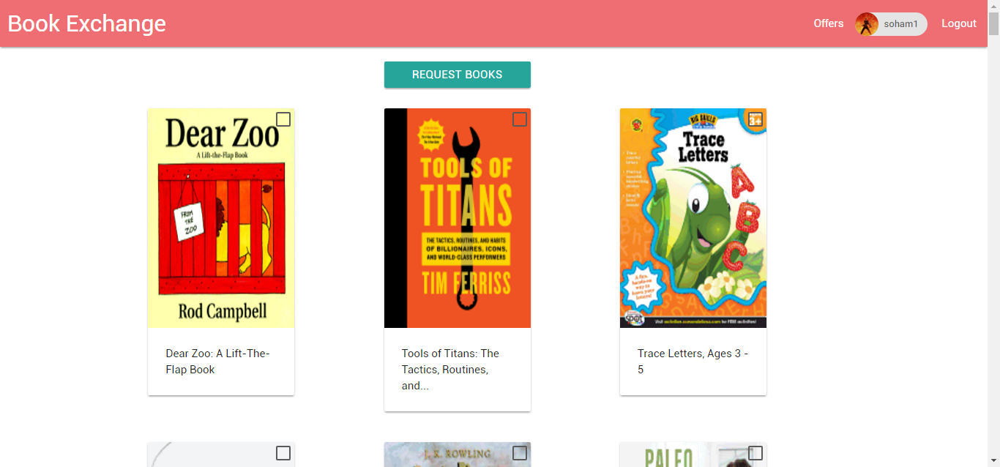
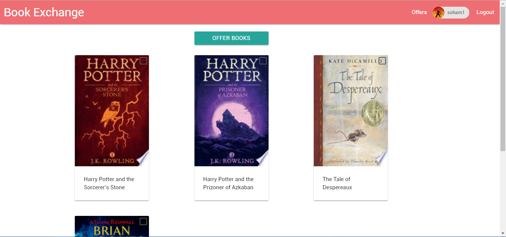
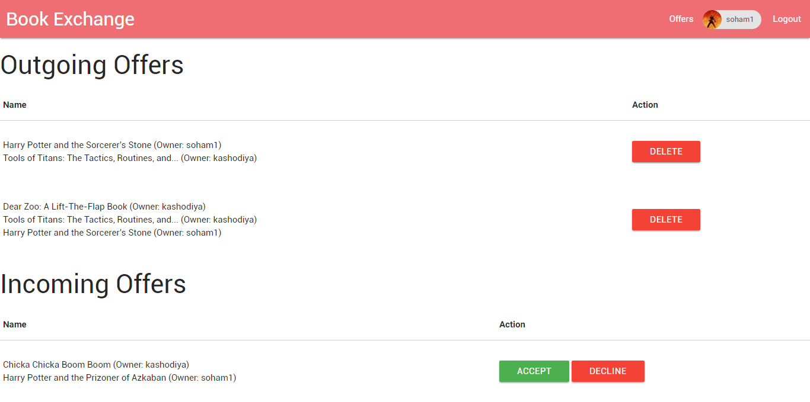

#Book Exchange

An application which allows users to make offers and trade books.

##Screenshots

###Landing Page

###User can see all of the books other users are offering. 

###User can make an offer for books he or she has requested.

###User can delete, decline, or accept incoming and outgoing offers.

##Technologies Used:
- Java
- Spring MVC
- JPA 
- Spring Security
- Spring OAuth2
- JDBC -> MySQL5
- MaterializeCSS
- jQuery
- Thymeleaf